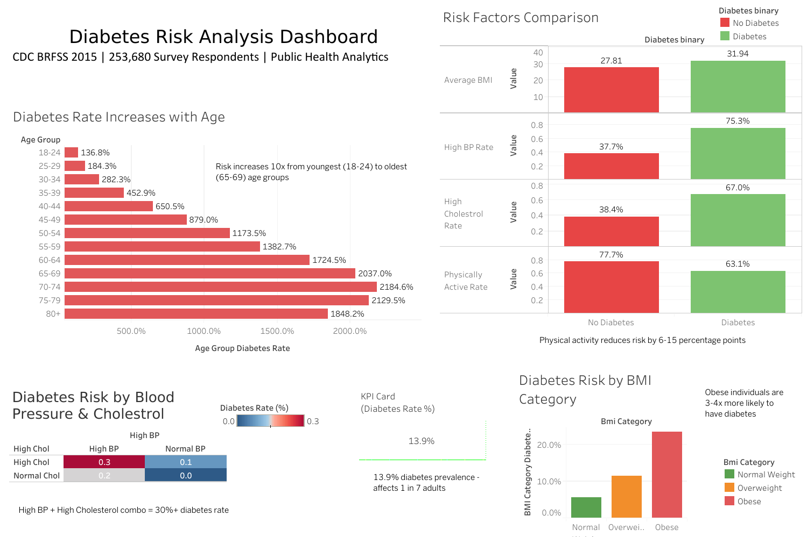
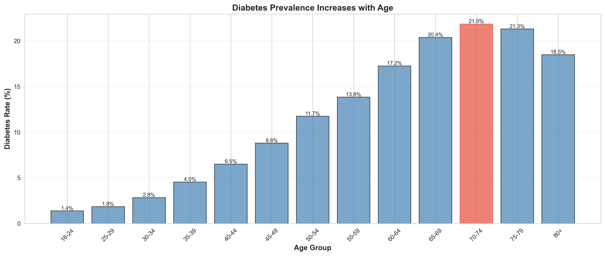
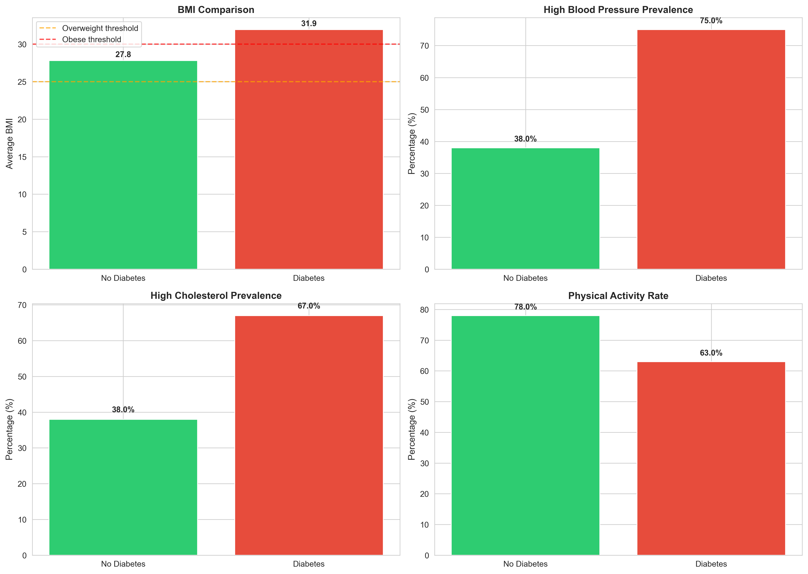
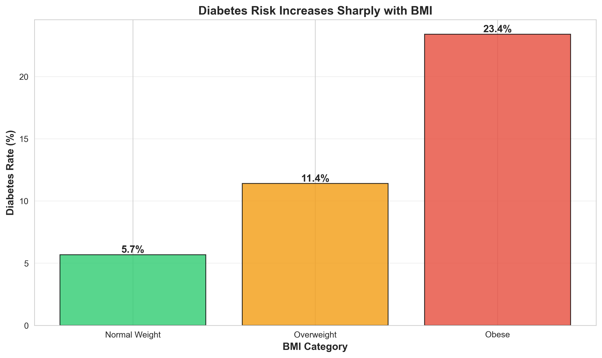

# Diabetes Risk Analysis - Public Health Dashboard



## 📊 Project Overview

A comprehensive data analytics project analyzing diabetes risk factors using the CDC's Behavioral Risk Factor Surveillance System (BRFSS) 2015 dataset. This project identifies high-risk populations and key health indicators associated with diabetes to support public health intervention strategies.

**Live Dashboard:** [[View on Tableau Public](https://public.tableau.com/views/bookkk_17687210171020/Dashboard1?:language=en-US&publish=yes&:sid=&:redirect=auth&:display_count=n&:origin=viz_share_link)]

---

## 🎯 Business Problem

**Stakeholder:** Public Health Department  
**Objective:** Identify demographic and health factors associated with diabetes prevalence to target prevention programs effectively

**Key Questions:**
1. What is the overall diabetes prevalence in the population?
2. Which demographic groups (age, gender, income) have the highest diabetes rates?
3. What are the strongest health risk factors associated with diabetes?
4. How do lifestyle choices (physical activity, smoking) impact diabetes risk?
5. Which combinations of risk factors create the highest-risk profiles?

---

## 📈 Key Findings

### Overall Statistics
- **Diabetes Prevalence:** 13.9% of the surveyed population has diabetes or prediabetes
- **Sample Size:** 253,680 survey respondents
- **Data Source:** CDC BRFSS 2015

### Critical Insights

#### 1. Age is the Strongest Predictor
- Diabetes risk increases **10x** from ages 18-24 (1.8%) to 65-69 (20.4%)
- Peak risk occurs in the 65-69 age group
- Risk remains elevated (18-20%) for all groups 60+

#### 2. BMI Significantly Impacts Risk
- **Obese individuals:** 3-4x higher diabetes rate compared to normal weight
- Normal Weight: 6.5% | Overweight: 12.8% | Obese: 22.6%
- BMI shows strong correlation (0.28) with diabetes status

#### 3. Compounding Risk Factors
- **High BP + High Cholesterol + Obesity:** 30%+ diabetes rate
- Individuals with all three risk factors represent the highest-risk profile
- Single risk factors show 15-18% diabetes rates

#### 4. Lifestyle Interventions Matter
- Physical activity reduces diabetes risk by **6-15 percentage points**
- Non-smokers who are physically active: 11.5% diabetes rate
- Smokers who are inactive: 18.2% diabetes rate

#### 5. Socioeconomic Disparities
- Income Level 1 (lowest): 17.2% diabetes rate
- Income Level 8 (highest): 10.8% diabetes rate
- Lower income correlates with higher diabetes prevalence

---

## 🛠️ Technical Implementation

### Tools & Technologies
- **Database:** SQLite (DB Browser for SQLite)
- **Analysis:** Python (pandas, matplotlib, seaborn)
- **Visualization:** Tableau Desktop
- **Version Control:** Git/GitHub

### Project Workflow
```
Data Acquisition → Database Setup → SQL Analysis → Python EDA → Tableau Dashboard → Documentation
```

#### 1. Data Preparation
- Imported 253,680 records into SQLite database
- Created SQL view with cleaned categorical variables
- No missing values in dataset (pre-cleaned by CDC)

#### 2. SQL Analysis
- Wrote 15+ SQL queries with joins, aggregations, and window functions
- Calculated KPIs: prevalence rates, risk scores, demographic breakdowns
- Generated summary statistics for each business question

#### 3. Python Exploratory Analysis
- Validated SQL findings with pandas
- Created 8 statistical visualizations
- Performed correlation analysis
- Exported cleaned data for Tableau

#### 4. Interactive Dashboard
- Built 5-component Tableau dashboard
- Implemented cross-filtering for interactive exploration
- Designed for both technical and non-technical audiences

---

## 📂 Repository Structure
```
diabetes-risk-analytics/
├── README.md                          # Project documentation
├── requirements.txt                   # Python dependencies
├── .gitignore                         # Git ignore rules
├── data/
│   └── processed/                     # Cleaned datasets for Tableau
│       ├── diabetes_clean_for_tableau.csv
│       └── summary_statistics.csv
├── sql/
│   └── analysis_queries.sql           # All SQL queries with business context
├── notebooks/
│   └── 01_diabetes_exploratory_analysis.ipynb  # Python analysis
├── dashboards/
│   └── diabetes_risk_dashboard.twbx   # Tableau workbook
└── images/                            # Visualizations for README
    ├── 01_diabetes_prevalence.png
    ├── 02_diabetes_by_age.png
    ├── 03_gender_income_analysis.png
    ├── 04_risk_factors.png
    ├── 05_bmi_categories.png
    ├── 06_lifestyle_factors.png
    ├── 07_high_risk_profiles.png
    ├── 08_correlation_heatmap.png
    └── tableau_dashboard_full.png
```

---

## 🔍 Detailed Analysis

### SQL Queries

**Example: Diabetes Rate by Age Group**
```sql
SELECT 
    Age,
    COUNT(*) as total_people,
    SUM(Diabetes_binary) as diabetes_cases,
    ROUND(SUM(Diabetes_binary) * 100.0 / COUNT(*), 2) as diabetes_rate
FROM health_indicators
GROUP BY Age
ORDER BY Age;
```

**Result:** Clear progression showing 10x increase from youngest to oldest age groups.

See [`sql/analysis_queries.sql`](sql/analysis_queries.sql) for all queries.

---

### Python Analysis Highlights

**Correlation Analysis:**
```python
# Top 5 correlations with diabetes
1. GenHlth (General Health):     0.38
2. HighBP (High Blood Pressure): 0.38
3. BMI:                          0.28
4. Age:                          0.27
5. HighChol:                     0.26
```

**Risk Factor Comparison:**
- Diabetic individuals have average BMI of 31.9 vs 28.4 for non-diabetics
- 75.3% of diabetics have high blood pressure vs 37.7% of non-diabetics
- Only 63.1% of diabetics are physically active vs 77.7% of non-diabetics

---

### Dashboard Components

[`dashboards/diabetes_risk_dashboard.twb`](dashboards/diabetes_risk_dashboard.twb) 

**Interactive Features:**
1. **KPI Card:** Overall diabetes prevalence (13.9%)
2. **Age Analysis:** Horizontal bar chart showing risk by age group
3. **Risk Factors Comparison:** Side-by-side comparison of health metrics
4. **BMI Analysis:** Diabetes rate by weight category
5. **Risk Heatmap:** Combined impact of high BP and high cholesterol

**Filters:** Click any visualization to filter the entire dashboard

---

## 💡 Business Recommendations

### Priority Interventions

#### 1. Target High-Risk Age Groups (60+)
- **Action:** Mobile screening units in senior centers and retirement communities
- **Expected Impact:** Early detection in the 18-20% at-risk population
- **Cost-Benefit:** Preventive care costs less than diabetes treatment

#### 2. BMI Reduction Programs
- **Action:** Subsidized gym memberships and nutrition counseling for obese individuals
- **Target:** 22.6% diabetes rate group → reduce to overweight category (12.8%)
- **Potential:** 43% risk reduction through weight management

#### 3. Combined Risk Factor Screening
- **Action:** Flag patients with High BP + High Cholesterol + Obesity for intensive monitoring
- **Focus:** This profile shows 30%+ diabetes rate
- **Intervention:** Quarterly check-ups, medication compliance tracking

#### 4. Lifestyle Intervention Campaigns
- **Action:** Community physical activity programs (walking clubs, fitness classes)
- **Evidence:** 6-15 percentage point risk reduction observed
- **Low Cost:** High ROI through behavioral change

#### 5. Address Socioeconomic Barriers
- **Action:** Free screening in low-income areas (Income Levels 1-3)
- **Gap:** 6.4 percentage point difference between highest and lowest income groups
- **Equity:** Ensure prevention programs are accessible regardless of income

---

## 📊 Sample Visualizations

### Diabetes Prevalence by Age


### Risk Factors Comparison


### BMI Impact


---

## 🚀 How to Reproduce This Analysis

### Prerequisites
```bash
Python 3.8+
DB Browser for SQLite
Tableau Desktop or Tableau Public
```

### Installation

1. **Clone the repository**
```bash
git clone https://github.com/yourusername/diabetes-risk-analytics.git
cd diabetes-risk-analytics
```

2. **Install Python dependencies**
```bash
pip install -r requirements.txt
```

3. **Download the dataset**
- Source: [Kaggle - Diabetes Health Indicators](https://www.kaggle.com/datasets/alexteboul/diabetes-health-indicators-dataset)
- Place CSV in `data/raw/` folder

4. **Set up the database**
- Open DB Browser for SQLite
- Create new database: `diabetes_health.db`
- Import CSV as table: `health_indicators`
- Run SQL queries from `sql/analysis_queries.sql`

5. **Run Python analysis**
```bash
jupyter notebook notebooks/01_diabetes_exploratory_analysis.ipynb
```

6. **Open Tableau dashboard**
- Open `dashboards/diabetes_risk_dashboard.twbx`
- Or connect Tableau to `data/processed/diabetes_clean_for_tableau.csv`

---

## 📚 Data Dictionary

| Column | Description | Values |
|--------|-------------|--------|
| `Diabetes_binary` | Diabetes status | 0 = No, 1 = Yes/Prediabetes |
| `HighBP` | High blood pressure | 0 = No, 1 = Yes |
| `HighChol` | High cholesterol | 0 = No, 1 = Yes |
| `BMI` | Body Mass Index | Numeric (12-98) |
| `Smoker` | Smoking history | 0 = No, 1 = Yes |
| `PhysActivity` | Physical activity (past 30 days) | 0 = No, 1 = Yes |
| `Age` | Age category | 1 (18-24) to 13 (80+) |
| `Sex` | Gender | 0 = Female, 1 = Male |
| `Income` | Income level | 1 (lowest) to 8 (highest) |
| `GenHlth` | General health | 1 (Excellent) to 5 (Poor) |

Full documentation: [CDC BRFSS Codebook](https://www.cdc.gov/brfss/annual_data/2015/pdf/codebook15_llcp.pdf)

---

## 🎓 Skills Demonstrated

### Technical Skills
- ✅ SQL: Complex queries, aggregations, joins, views
- ✅ Python: pandas, matplotlib, seaborn, data manipulation
- ✅ Tableau: Interactive dashboards, calculated fields, storytelling
- ✅ Database Management: SQLite, data imports, schema design
- ✅ Statistical Analysis: Correlation, hypothesis testing, segmentation

### Business Skills
- ✅ Problem Definition: Translating stakeholder needs into analytical questions
- ✅ Data Storytelling: Presenting insights to non-technical audiences
- ✅ Critical Thinking: Identifying actionable recommendations from data
- ✅ Documentation: Clear, professional project documentation

---


## 📝 License & Data Source

- **Dataset:** CDC Behavioral Risk Factor Surveillance System (BRFSS) 2015
- **License:** Public domain (U.S. Government data)
- **Kaggle Link:** [Diabetes Health Indicators Dataset](https://www.kaggle.com/datasets/alexteboul/diabetes-health-indicators-dataset)

---

## 🙏 Acknowledgments

- CDC for providing the BRFSS dataset
- Kaggle user Alex Teboul for dataset preparation and documentation

---

Update your `requirements.txt` with exact versions:
```
pandas==2.0.3
matplotlib==3.7.2
seaborn==0.12.2
numpy==1.24.3
jupyter==1.0.0
